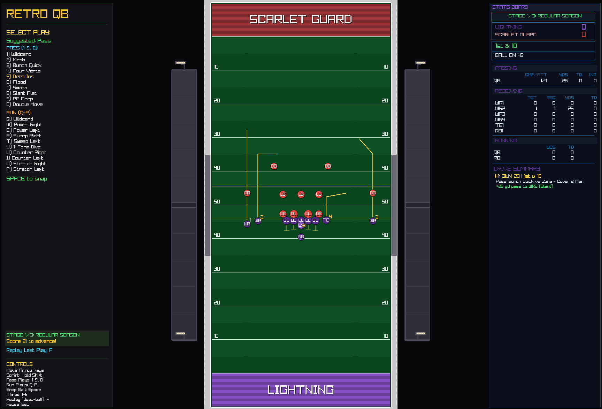

# 🏈 RetroQB

**Step into the pocket. Read the defense. Make the throw.**

RetroQB is a fast-paced retro-style 2D American football game where YOU are the quarterback. Call plays, dodge rushers, and lead your receivers to the end zone in this love letter to classic arcade sports games.

Built with C# and Raylib for that crisp, responsive feel.

---

## 📸 Screenshots

<p align="center">
  
</p>

<p align="center">
  <em>Lead your receivers downfield and find the open man!</em>
</p>

<!-- Add more screenshots as needed:
<p align="center">
  
</p>
-->

---

## ⚡ Features

- **Classic Arcade Feel** — Simple controls, pure gameplay
- **Dynamic Defense** — AI defenders with realistic coverage and pursuit
- **Multiple Play Types** — Quick passes, deep bombs, or scramble for yards
- **Progressive Difficulty** — Defense gets faster as you score
- **Drive Tracking** — Watch your plays unfold in the drive summary

---

## 🎮 Controls

| Action | Key |
|--------|-----|
| Move | `WASD` or `Arrow Keys` |
| Sprint | `Left Shift` |
| Snap Ball | `Space` |
| Throw Pass | `Space` (during play) |
| Cycle Receiver | `Tab` |
| Select Play | `1` / `2` / `3` |
| Restart Drive | `R` |
| Pause | `Esc` |

---

## 🏃 How to Play

1. **Pre-Snap**: Choose your play type (Quick Pass, Long Pass, or QB Run)
2. **Snap**: Press `Space` to start the play
3. **Read the Defense**: Use `Tab` to cycle through receivers and find the open man
4. **Make Your Move**: 
   - Throw with `Space` before crossing the line of scrimmage
   - Or tuck it and run! Sprint past defenders for big gains
5. **Score Touchdowns**: Reach the end zone for 7 points

---

## 🚀 Quick Start

```bash
cd RetroQB
dotnet run
```

**Requirements**: .NET 9.0 SDK

---

## 🎯 Tips & Strategy

- **Timing is everything** — Throw before the rush gets to you
- **Lead your receivers** — The ball is thrown where they're going, not where they are
- **Watch for contested catches** — Defenders nearby can cause drops or interceptions
- **Know when to run** — Sometimes the best play is to scramble
- **Manage the downs** — Don't force throws into coverage on early downs

---

## 📁 Project Structure

```
RetroQB/
├── AI/           # Defender and receiver AI behaviors
├── Core/         # Game constants, state, and utilities
├── Entities/     # QB, receivers, defenders, ball
├── Gameplay/     # Play management and game session
├── Input/        # Player input handling
└── Rendering/    # Field and HUD rendering
```

---

*Can you lead your team to victory? The pocket is collapsing. Clock is ticking. Make the call.*
