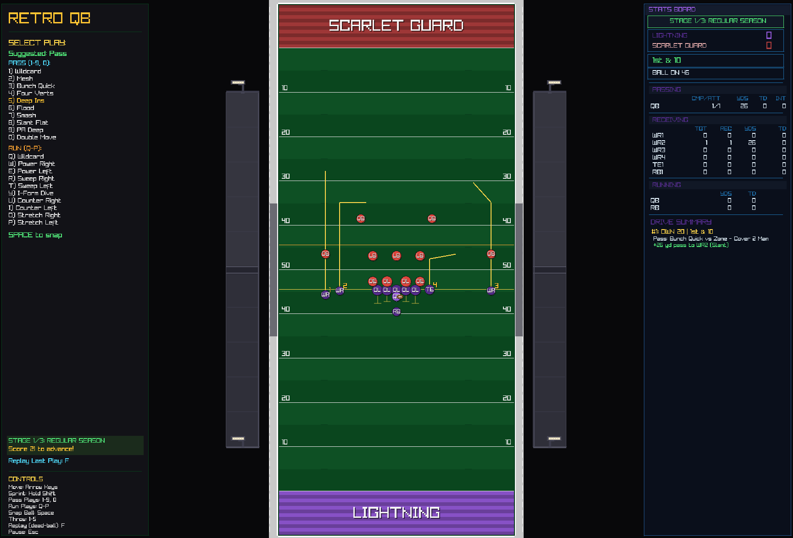

# 🏈 RetroQB

**Step into the pocket. Read the defense. Make the throw.**

RetroQB is a fast-paced retro-style 2D American football game where YOU are the quarterback. Call plays, dodge rushers, and lead your receivers to the end zone in this love letter to classic arcade sports games.

---

## 📸 Screenshots

<p align="center">
  
</p>

<p align="center">
  <em>Lead your receivers downfield and find the open man!</em>
</p>

<!-- Add more screenshots as needed:
<p align="center">
  
</p>
-->

---

## ⚡ Features

### 🎮 Core Gameplay
- **3-Stage Season Mode** — Win the Regular Season, Playoff, and Super Bowl to become Champion
- **Increasing Difficulty** — Each stage features tougher defensive opponents
- **Classic Arcade Feel** — Simple controls, pure football action
- **Multiple Play Types** — Quick passes, deep bombs, scrambles, and dedicated run plays
- **Drive Tracking** — Watch your plays unfold in the drive summary with detailed stats
- **Player Statistics** — Track QB, rushing, and skill position stats on the scoreboard

### 🏈 Offensive Systems
- **Team Selection** — Choose from 3 unique teams with different offensive rosters
- **Slot-Based Skills** — Receivers have unique attributes based on their position
- **Smart Route Running** — Deep posts, curls, and dynamic route progression
- **Run Game Mechanics** — OL lane creation, backside sealing, and RB cut boosts
- **Offensive Line AI** — Pass blocking pocket formation and run blocking assignments

### 🛡️ Defensive AI
- **Zone Coverage** — Cover 2 zone with realistic depth adjustments
- **Man Coverage** — Defenders track and pursue receivers intelligently  
- **Blitz Concepts** — Varied pass rush schemes including edge rush
- **DE Position** — Dedicated defensive ends with edge rush capabilities
- **Endzone Awareness** — Defense adjusts depth near the goal line

### 🎨 Presentation
- **Retro Stadium Visuals** — Bleachers, sidelines, and field markings
- **Resizable Window** — Play at your preferred screen size
- **Side Panel HUD** — Clean scoreboard and play information
- **Position Labels** — See receiver assignments at a glance
- **Auto Target System** — Highlights the best available receiver

---

## 🎮 Controls

| Action | Key |
|--------|-----|
| Move | `WASD` or `Arrow Keys` |
| Sprint | `Left Shift` |
| Snap Ball | `Space` |
| Throw Pass | `1` `2` `3` `4` `5` |
| Replay Last Play (dead-ball) | `F` |
| Select Play | `1` / `2` / `3` |
| Confirm / Next Drive / Continue | `Enter` |
| Pause | `Esc` |

---

## 🏃 How to Play

1. **Choose Your Team**: Select from 3 unique offensive teams
2. **Win 3 Stages**: Beat each stage by scoring 21 points
   - **Regular Season** — Balanced defense, learn the ropes
   - **Playoff** — Tougher defense with aggressive schemes
   - **Super Bowl** — Elite defense, the ultimate challenge
3. **Pre-Snap**: Choose your play (pass or run)
4. **Snap**: Press `Space` to start the play
5. **Read the Defense**: Receivers are labeled by priority `1`-`5`
6. **Make Your Move**: 
   - Throw with `1`-`5` before crossing the line of scrimmage
   - Or tuck it and run! Sprint past defenders for big gains
7. **Score Touchdowns**: Reach the end zone for 7 points
8. **Become Champion**: Win all 3 stages to hoist the trophy!

**Replay Tip**: After a play ends, press `F` during dead-ball screens or at pre-snap to watch the last play replay.

---

## 🚀 Quick Start

```bash
dotnet run
```

**Workspace Tip**: Open the repo root folder (`Football2DQB`) in VS Code. This repo includes a `.vscode/settings.json` that limits Git auto-detection so the nested `RetroQB/` folder doesn't show as a separate repo.

**Requirements**: .NET 9.0 SDK

---

## 🎯 Tips & Strategy

- **Timing is everything** — Throw before the rush gets to you
- **Lead your receivers** — The ball is thrown where they're going, not where they are
- **Watch for contested catches** — Defenders nearby can cause drops or interceptions
- **Know when to run** — Sometimes the best play is to scramble
- **Manage the downs** — Don't force throws into coverage on early downs

---

## 📁 Project Structure

```
RetroQB.csproj    # Project file (run from repo root)
RetroQB/
├── AI/           # Defender targeting, offensive line AI, zone coverage
├── Core/         # Constants, game state, field geometry, rules
├── Data/         # Team attributes, rosters, and team presets
├── Entities/     # QB, receivers, defenders, ball, blockers
├── Gameplay/
│   ├── Controllers/   # Play execution, blocking, tackling, menus
│   └── Factories/     # Formation and defense creation
├── Input/        # Centralized player input handling
├── Rendering/    # Field, HUD sub-renderers, stadium, fireworks
├── Routes/       # Route types, geometry, running, and assignment
└── Stats/        # QB/rush/skill stat lines and tracking
```

---

## 🙏 Written with

- Opus 4.5
- GPT-5.2-Codex
- Visual Studio Code
- GitHub Copilot

---

*Can you lead your team to victory? The pocket is collapsing. Clock is ticking. Make the call.*
