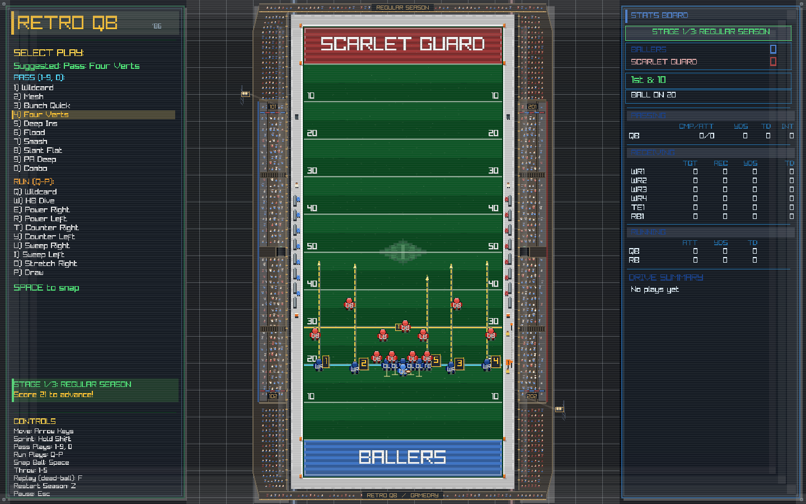
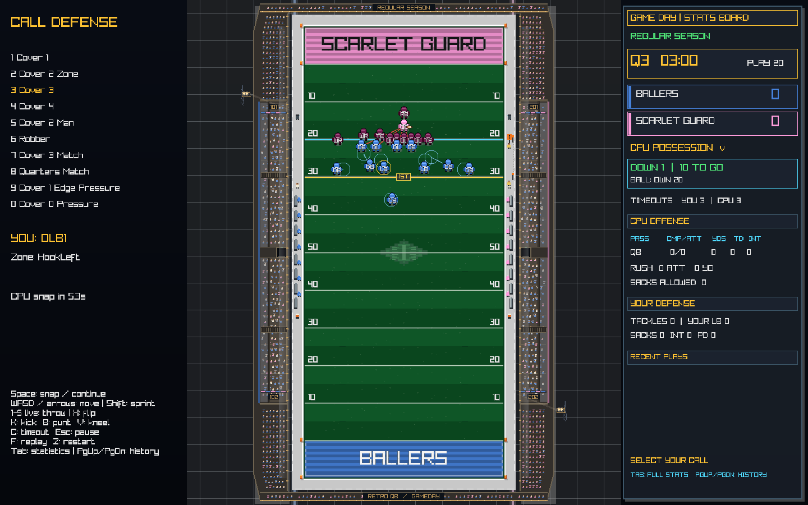
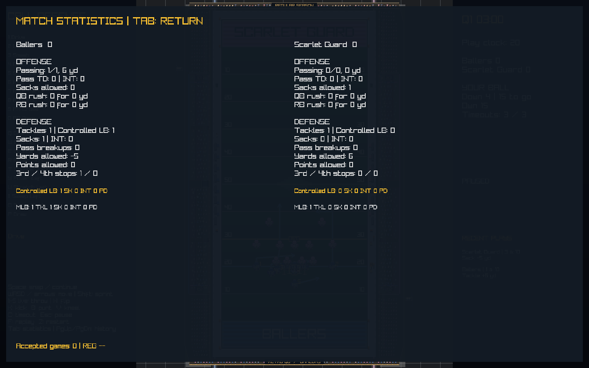

# RetroQB

Call both sides of the ball in a top-down arcade football season. Lead the offense, then control one linebacker while the CPU runs its own drives. Win the Regular Season, Playoff, and Super Bowl to become champion.





## Play

Requires the .NET 10 SDK. Run from the repository root:

```powershell
dotnet run
```

Choose one of ten teams with Up/Down or 1–9/0, then press Enter. G opens the secret-team password prompt. Press Enter on the matchup screen to play immediately. Enter your name on the original save-score screen after your season ends.

Your team always attacks up-screen and defends the bottom end zone. The field stays fixed across possession changes, with screen-relative linebacker controls.

Each game has two two-minute halves (H1 and H2), a 20-second play clock, and three timeouts per half. Possession changes put you on the other side of the ball. Touchdowns score seven, field goals three, and safeties two, only for the scoring team. Reaching 21 does not end the game. Tied regulation uses paired possessions from the opponent's 25; both teams get an attempt before a winner is decided.

On offense, choose from ten situational pass calls and ten run calls drawn from the 100-call catalog. Route and blocking previews show the selected assignment. The CPU uses that catalog too. See the [playbook guide](docs/playbook-expansion.md).

On defense, choose one of ten coverage/pressure calls. The highlighted player is always your linebacker: MLB in base personnel or OLB1 in nickel. Move and sprint to cover, contain, or pursue; contact handles tackles and pass interactions. The CPU snaps after its cadence, or Space signals that you are ready.

A completed drive shows its outcome, play count, yards, points, and next possession. Press Space to continue; F replays the last play and Tab opens statistics.

At a final result, Enter accepts the game and advances after a win. After a loss or the Super Bowl, enter your name and press Enter to save the season; Enter then returns to team selection.

## Controls

| Action | Key |
| --- | --- |
| Move / sprint | WASD or arrows / Left Shift |
| Offensive pass call / defensive call before snap | 1–9, 0 |
| Offensive run call before snap | Q W E R T Y U I O P |
| Flip offensive call | X |
| Snap / ready / continue a drive or period summary | Space |
| Throw to receiver during a live offensive pass | 1–5 |
| Select field goal / punt / kneel | K / B / V |
| Timeout | C |
| Pause | Esc |
| Statistics / return | Tab |
| Scroll recent plays | Page Up / Page Down |
| Replay last play / skip replay | F / Space |
| Restart current matchup, preserving accepted earlier games | Z |
| Accept pregame or final result / return after saving | Enter |

Pause, statistics, replay, and loss of window focus suspend play. Restart is disabled after the completed season is saved.

For a field goal, press K before the snap, then Space to snap. Once the holder is ready, use Space to start the meter, lock power, and lock accuracy in the green zones. Distance includes the end zone and snap; attempts beyond 60 yards are unavailable. A miss changes possession without awarding points. Select another offensive call before snapping to leave kick setup. Punts are available only on fourth down in regulation. B selects the punt formation; Space snaps to the punter, who kicks downfield. The CPU normally goes for it, punting only inside its own 20 with more than five yards to gain (unless late-game urgency requires going for it).

Kickoffs start each half and follow scores in regulation. Space starts your kick or readies your receiving team; CPU kickers also start automatically. The kicking side controls a coverage linebacker, while the receiving side controls the highlighted returner after the catch. WASD/arrows move in screen directions and Shift sprints. Coverage and blockers move on the field; tackles, sidelines, touchbacks, return touchdowns and return safeties determine the next possession. Kickoff flight does not consume the half clock; the clock starts on the return.

## Records and current limitations

Records live at `%LOCALAPPDATA%\RetroQB\player-records.json`, with a `.bak` backup. Version 2 preserves legacy records and ranks timed seasons separately. Detailed game results include both units' statistics and controlled-linebacker contributions. The season rating retains the existing offensive formula. Failed saves can be retried with Enter.

This is an arcade ruleset: no fumbles, extra-point attempts, defender switching, or manual tackle/swats. Punt and kickoff direction/distance are automatic and seeded; there are no onside kicks, fair-catch controls, or blocked kicks yet. Scrimmage replays remain available; punt/kickoff replay is not yet recorded. CPU field goals use seeded distance-based outcomes; human kicks use the timing meter. Delay of game is enforced, but the full football penalty rulebook is not simulated.

Phase 6 automated verification is documented in the [release report](docs/phase6-verification.md). Hands-on balance, defensive influence, and pacing review remain pending; automated simulations do not establish those qualities.

## Development

C# / .NET 10, Raylib-cs 7.0.2; publish target Windows x64.

```powershell
dotnet build
dotnet test tests/RetroQB.Tests/RetroQB.Tests.csproj
dotnet build -c Release
```

Debug-only reproducible verification:

```powershell
dotnet run -- --scenario release-catalog --headless --output artifacts/phase6/candidate
dotnet run -- --scenario release-matches --headless --output artifacts/phase6/candidate
dotnet run -- --scenario release-default --headless --output artifacts/phase6/candidate
dotnet run -- --scenario timed-layout --capture --output artifacts/phase6/layouts
```

The release matrix freezes its seeds internally. Layout capture exports menu, pregame, offense, defense, statistics, kicking, halftime, overtime, final, replay, punt/kickoff sequences, and the end-of-season name screen at four sizes. README images use its 1440×900 captures.

Other fixtures include `timed-short`, `late-tying-kick`, `late-protect-lead`, `overtime-pairs`, and `timed-season-short`. Original `offense-*` fixtures retain isolated legacy regression adapters. Normal startup always uses timed two-sided seasons; Release builds reject scenario arguments.

The latest [playtest changes and verification](docs/playtest-feedback-2.md) cover two-minute halves, end-of-season name entry, QB movement, and playable punts/kickoffs.
