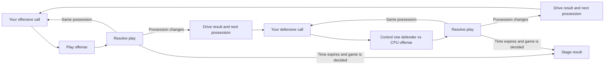

# Playable defense: design and implementation plan

Status: design direction accepted, September 19, 2026. [Phase 0 verification foundations](phase0-verification.md) are implemented; playable defense and timed-game rules remain future work. Tuning defaults remain subject to playtesting.

For ordered engineering work, test scenarios, milestone gates, and progress tracking, see the [engineering roadmap](playable-defense-engineering-roadmap.md).

## Goal

Turn RetroQB into a game where the player calls plays and participates on both sides of the ball. Preserve the current offensive playbook, field presentation, quick decisions, and three-stage season. On defense, the player chooses a defensive call and controls one defender while teammates execute their assignments against a CPU offense using the existing offensive plays.

“Similar to offense” means the same choose / preview / snap / play / result rhythm and visual layout. Defensive calls have their own coverage, rush, and assignment data; they are not offensive route plays with different labels.

## Confirmed direction and proposed defaults

Confirmed by the user: always control a linebacker, and introduce quarters and a game clock in this first release. Quarter length, timeout rules, and overtime below are proposed defaults for review during implementation.

- Always control one designated linebacker until the whistle: MLB in base personnel, OLB1 in nickel personnel where MLB is absent. Show the assignment clearly before every snap; there is no defender-selection or switching input.
- Replace first to 21 with four timed quarters, retaining the Regular Season / Playoff / Super Bowl progression. Start tuning with three-minute quarters (12 minutes of regulation game time, with a longer real session because of stoppages).
- Reuse automatic contact tackles and ball contests. Positioning is the initial defensive skill; dive tackles, swat buttons, and mid-play switching can follow playtesting.
- Ship ten defensive calls based on existing coverage schemes and explicit pressure packages.
- Keep the offense moving up the screen on every possession. When defending, your team lines up above the CPU offense and protects the top end zone.
- Interceptions end at the catch spot; no returns in this release. Punts and kickoffs use simple possession transitions. Preserve the player's field-goal timing game and add CPU kick resolution.
- Make two-sided play the normal season experience after validation. A development-only toggle can protect the existing experience during implementation; a permanent second game mode is outside this proposal.

## What exists and what must change

| Area | Current implementation | Design consequence |
| --- | --- | --- |
| Match flow | `GameSession` ends games at 21; new drives always restart the user's offense | Introduce explicit possession and team identity |
| Scoring | `DriveState` awards away points for interceptions, failed fourth downs, and field-goal outcomes | Remove simulated opponent scoring; only actual scoring events change the score |
| Field position | `DriveState.Reset()` always starts at the own 20; routes and rules advance along positive Y | Start drives at explicit spots; transform the spot when possession changes |
| Defense | Nine schemes, base/nickel personnel, coverage roles, pressure packages, adaptive memory | Reuse execution; expose authored calls and stable assignments |
| Setup | `PlaySetupController.SetupPlay()` chooses blitzers even after receiving a coverage decision | Separate resolving a call from instantiating it, so user choices survive setup |
| Control | `PlayExecutionController` sends keyboard movement to the QB or receiver holding the ball | Route human input by team and actor, independently of ball possession |
| Opponent offense | Routes, protection, exchanges, and throwing physics exist; QB decisions and carrier AI do not | Build CPU decision logic on top of the existing simulation |
| Teams | Menu teams have offensive attributes; stage opponents have defensive attributes | Give every team both units and a stable identity |
| Statistics | A single offensive tracker and offense-based season rating | Attribute events to teams; keep CPU offense out of player totals |
| Presentation | Scores, banners, crowd reactions, and replay context assume the player is on offense | Make presentation aware of user team, possession, and controlled defender |

## Player experience

### Possession loop



Before each defensive snap:

1. The CPU commits to an offensive call using situation, team tendencies, and recent calls. Browsing defensive calls does not reroll that offensive play.
2. Show the opponent's visible formation/personnel, down, distance, field position, and score. Hide offensive play name, routes, intended target, and coaching text in every live panel.
3. Show defensive calls in the existing side-panel style: name, coverage, pressure, strength, and tradeoff.
4. Preview zone areas, man-assignment lines, and rush arrows from the same resolved assignments the defenders will execute. Highlight the controlled linebacker and show their responsibility, such as “OLB1 — left hook / run support.”
5. The CPU has a visible snap countdown; Space confirms readiness and can shorten it. Defensive browsing cannot postpone the CPU snap. The game clock follows the rules below while browsing; only a real pause freezes both clocks. No free pre-snap player movement occurs.

During play, a persistent ring identifies the controlled linebacker. A subtle assignment cue remains available, but the player may leave the assignment. AI teammates retain their jobs; they do not magically fill the vacated zone. Contact, blocking, tackle breaks, and pass contests still apply to the controlled linebacker. Authored calls should provide a useful mix of middle coverage, run support, and blitz responsibilities for this role.

After play, show the result from the user's perspective: “SACK — loss of 6,” “STOP — your ball,” or “Opponent touchdown.” A possession banner identifies the next offense and starting spot. Keep Enter to continue and F for replay.

### Proposed defense controls

| Context | Input | Action |
| --- | --- | --- |
| Pre-snap | 1–9 / 0 | Select one of ten defensive calls |
| Pre-snap | X | Mirror a supported pressure call and its assignments |
| Pre-snap | Space | Ready; shorten CPU countdown when defending, snap when attacking |
| Live play | WASD / arrows | Move the controlled linebacker in screen directions |
| Live play | Left Shift | Sprint, subject to tuning and blocking |
| Live play | Contact / ball proximity | Automatic tackle or pass contest using shared rules |
| Existing contexts | Esc / F / Enter / Z | Pause / replay / continue / restart |
| Eligible dead ball / pre-snap | C | Spend a team timeout and stop the game clock |

No pre-snap free movement in the first release, which avoids introducing offside rules. Offensive throw keys and field-goal selection do not fire during defensive control. Derive the controlled linebacker from the resolved personnel every snap; visibly identify the nickel fallback. Do not switch players after a catch or automatically chase the carrier with the user's linebacker. Mirror calls without changing which active linebacker the user controls.

### Initial defensive call sheet

| Key | Call | Scheme / pressure | Intended decision |
| --- | --- | --- | --- |
| 1 | Cover 1 | Cover1, four-man rush | Man coverage with deep middle help |
| 2 | Cover 2 Zone | Cover2Zone, four-man rush | Protect flats and deep halves |
| 3 | Cover 3 | Cover3Zone, four-man rush | Three deep zones and underneath support |
| 4 | Cover 4 | Cover4Zone, four-man rush | Prioritize deep coverage |
| 5 | Cover 2 Man | Cover2Man, four-man rush | Man coverage with two deep helpers |
| 6 | Robber | Robber, four-man rush | Attack inside passing lanes |
| 7 | Cover 3 Match | Cover3Match, four-man rush | Existing simplified matching behavior |
| 8 | Quarters Match | QuartersMatch, four-man rush | Existing quarters matching behavior |
| 9 | Cover 1 Edge Pressure | Cover1, one explicit extra edge rusher | Trade an underneath defender for pressure |
| 0 | Cover 0 Pressure | Cover0, explicit compatible pressure package | Maximum pressure with no deep help |

Personnel stays automatically matched to visible offensive formation for this release. Every call must resolve legally for both base and nickel personnel. Pressure calls require explicit replacement coverage responsibilities; selecting a blitzer must not silently discard a receiver matchup. Call tuning and wording are subject to playtesting. Full pattern-match rules, custom personnel selection, disguises, and audibles are later work.

## Possession and scoring rules

The following are deliberate arcade rules for this release, not a claim of complete league-rule simulation.

| Event | Points | Next possession / spot |
| --- | --- | --- |
| Tackle, sack, out of bounds | None | Same offense; advance down/distance normally |
| Incompletion or pass defended | None | Same offense; next down, same spot |
| First down | None | Same offense; new series, goal-to-go distance capped at goal line |
| Failed fourth down | None | Other team at the dead-ball spot |
| Interception | None | Other team at interception spot; own-end-zone catch becomes own 20 |
| Touchdown | 7, including automatic extra point | Other team at own 20 |
| Field goal made | 3 to kicking team only | Other team at own 20 |
| Field goal missed | None | Other team at kick spot or own 20, whichever is farther upfield |
| Safety | 2 to defending team | Scoring team receives at own 20 via abstracted free kick |
| Punt | None | Other team after 40 yards of net field position; end-zone punts become own 20 |

Fourth-down failure takes precedence over ordinary incomplete/tackle continuation. Preserve the original play result and final spot in the record even when the series ends. An interception spot comes from defensive contact with the ball, not the previous line of scrimmage.

Add a punt option to the offensive call UI using a dedicated input outside the existing Q–P run keys (proposed: B). Punting is available on fourth down for both teams. No return, block, or timing minigame initially. CPU fourth-down decisions weigh distance, field position, score, and whether a made kick would win. CPU kick accuracy uses distance and seeded randomness through the same kick-result/scoring contract, never human input. Candidate probabilities are tuning data; they must be fixed and tested before release.

Select the opening offense once per match with a seeded coin result, without adding a coin-toss screen. Show it on the matchup screen; restart preserves that opening assignment. The other team receives at the start of the second half. Scores can exceed 21; only period completion and overtime rules determine the winner.

## Quarters, clocks, and end-game rules

### Regulation

- Four three-minute quarters as the initial tuning default. Show quarter, remaining game time, possession, timeouts, and a compact play clock in the existing scoreboard/HUD.
- Quarter 1 -> 2 and quarter 3 -> 4 preserve possession, spot, down, and distance. Keep the offense-relative screen orientation. Halftime ends the current drive and starts the designated receiving team at its own 20 in quarter 3.
- Run the game clock during live plays. When it reaches 0:00, finish the play normally, including a field goal already snapped; then apply scoring, possession, and period rules. Do not truncate a ball in flight or a run at the buzzer.
- After an in-bounds tackle/sack or first down, stop clocks during the brief result presentation, then resume the game clock when pre-snap is ready. This short presentation freeze is a deliberate arcade simplification, not an extra user-controlled wait.
- After incompletions, pass defense, out of bounds, scoring, changes of possession, timeouts, and period breaks, keep the game clock stopped until the next snap. No two-minute warning in the first release.
- Nonterminal play results advance automatically; an Enter-gated overlay must never sit between an in-bounds result and a running clock. Drive summaries can wait for Enter because possession-change clocks are stopped.
- Pause and replay suspend both clocks and restore their previous run/stop state on return. Replay is review only and consumes no game time. Input focus changes must not silently advance the simulation.

### Pre-snap timing and timeouts

- Use a 20-second play clock whenever pre-snap becomes ready, regardless of whether the game clock is running. The user's current offensive call and defensive call are always valid defaults.
- CPU offense chooses a snap delay once per play: initially 5–8 seconds, shorter when trailing late and longer when protecting a lead. Freeze that deadline while paused; changing the defensive call never resets it. Space may shorten the countdown with a minimum visible cadence, but cannot force a snap later.
- Expired offensive play clock produces a five-yard delay-of-game penalty, limited to half the distance to the offense's goal, with no loss of down. Reset the play clock and keep the game clock stopped until the next snap. This prevents repeated delay penalties from draining regulation time. CPU deadlines must always precede play-clock expiry.
- Give each team three timeouts per half, without carryover. C is available in the dead-ball/pre-snap phase, including the brief in-bounds result window. It stops the game clock and resets the play clock once. Return to pre-snap after a short banner; no long timeout screen.
- CPU timeout logic must stop the clock when trailing and unable to recover possession in time, and preserve time for a final scoring drive. It cannot call a timeout during a live play or repeatedly consume timeouts in one dead-ball event.
- If the game clock expires before the snap, end the period without starting the play. If the snap and expiry share a simulation tick, use one documented clock-first ordering and test it.

### End of regulation and overtime

After the final play of quarter 4, the higher score wins. On a tie, use a compact, explicitly arcade overtime format: each team gets one possession starting at the opponent's 25. Complete both possessions before comparing scores. If still tied, repeat a pair with the opening team alternated. No game clock in overtime; keep the play clock and give each team one timeout per pair. Retain automatic extra points and dead-ball interceptions; do not implement returns or full professional overtime rules for this release.

Represent overtime attempts separately from ordinary pending possessions: a turnover or missed kick ends the attempt, and the next attempt starts at the fixed overtime spot. Disable punts in overtime. The next pair starts with a fresh series and its own attempt counter. No score-based early match end remains from the old first-to-21 code.

Timed football also needs intentional clock management. Add an explicit kneel action on offense (proposed V, converted into the selected pre-snap play and executed with Space): a short live action, one-yard loss subject to goal-line safety rules, down consumed, clock continues after the result. CPU may kneel only when remaining time, downs, play clock, and opponent timeouts make it sensible. Clock expiration replaces the need for a scoring drive when protecting a lead.

### Field coordinates

Keep simulation coordinates offense-relative: the offense always advances along positive Y and appears to move upfield. “Home,” “user,” and “offense” must be different concepts in data and rendering.

For an ordinary possession change, convert `oldOffenseYards = oldWorldY - EndZoneDepth` to `newOffenseYards = 100 - oldOffenseYards`, then rebuild at `EndZoneDepth + newOffenseYards`. For example, losing the ball at your own 35 gives the opponent the ball at your 35, which is 65 yards from their own goal. Apply touchback and scoring exceptions before constructing the next drive. Use the shared end-zone constant; `FieldGeometry.FieldLength` is the 100-yard playing area, while rendering constants include end zones.

Rebuild formations only after the play ends, during automatic next-play setup or after the user continues from a possession-change summary. Never rotate a live play or a replay. Team colors, scoreboard sides, and crowd allegiance remain attached to team identity when unit roles swap. A future fixed-stadium-direction camera can be added behind a presentation transform; it is not needed to make defense playable.

## Technical design

### Match state and teams

Introduce `MatchState` as the owner of user/opponent team IDs, possession team ID, score by team, opening/second-half receivers, and match rules. `DriveState` owns the current series and its explicit starting spot, not match scores or synthetic opponent scoring. `GameSession` orchestrates existing states; add period-break/halftime presentation and a small cadence substate rather than duplicating every state into offense/defense variants.

Add a pure `MatchClock` for period, remaining time, play clock, pending period end, timeout counts, and an explicit run/stop reason. A `MatchRules`/period resolver owns halftime, regulation completion, and overtime attempt sequencing. Pass clamped simulation `dt` into clocks; rendering, replay playback, and UI browsing must not mutate them independently. Replay captures period/time without mutating the live clock; restart resets to quarter 1 with full timeouts and the original opening receiver. Terminal events need an explicit out-of-bounds reason: `TackleCheckResult` currently collapses sideline exits into a generic tackle, which cannot drive correct stoppages.

Introduce `TeamDefinition` with a stable ID, shared name/colors, offensive attributes/roster, defensive attributes/roster, and CPU tendencies. Map all selectable teams, including the secret team, to defensive profiles, and give each stage opponent an offensive profile. Preserve their existing identities. Resolve active offense and defense from possession, not from “player team” fields.

Stage difficulty applies to the opponent on either side of the ball. Isolate defensive memory and play-call usage by team. Replace or constrain the existing score/first-down-driven defender speed escalation so changing possession never boosts the user's defenders accidentally.

### Shared simulation and control ownership

Add `ControlContext` for user team, current phase, and controlled actor/linebacker slot. Keep it separate from `PossessionControl`, which currently protects movement handoffs between offensive ball carriers. A single linebacker policy maps base personnel to MLB and nickel to OLB1; do not expose arbitrary defender selection in this release.

Introduce an `OffensiveIntent` (movement, sprint, optional throw target) supplied by either human input or CPU decisions. Resolve defender movement through either AI targeting or human input, exactly once per defender per frame. Shared blocking, collision, animation, tackling, and ball integration run for both.

Do not simply skip the controlled linebacker's entire AI method without extracting shared movement effects: block slowdown, separation, speed limits, animation, and integration still need to run. A blocked human defender must not regain full speed on the next input update.

Expose an input-independent throw command in `BallController`; human and CPU callers share eligibility, backfield readiness, line-of-scrimmage restrictions, pressure, trajectory, catch, and interception resolution. Route CPU carrier movement separately in `ReceiverUpdateController`: currently any receiver holding the ball becomes the human-controlled receiver.

### CPU offense

- `OffensiveCoordinator`: reuse catalog calls and situational weights; select once per snap, retain call diversity, and add explicit team tendencies. Extend situation data with quarter, remaining time, score margin, timeouts, and overtime attempt state. It may use public situation and prior plays, not the selected defensive call or human input. Fourth-down, sideline, hurry-up, kneel, and kick decisions must reflect the clock.
- `QuarterbackAI`: follow the called exchange/drop, evaluate eligible routes on a reaction interval, estimate reachable passing windows using receiver/defender positions and ball travel time, and choose a target. Separation alone is insufficient when a defender sits in the passing lane.
- Respect arm range, play-action locks, blocker releases, and the ban on throwing after crossing the line. Apply difficulty through reaction time, decision quality, and existing ratings. Do not read future positions, RNG outcomes, or the player's next keypress.
- With no viable throw, progress to a checkdown, scramble, or a legal throwaway. Behind the line, permit an explicit sideline throwaway only outside the original tackle box; otherwise scramble or take the sack. Do not turn a timer into an automatic incompletion.
- `BallCarrierAI`: use the authored run direction after handoff, then score nearby lanes for forward progress, blockers, defenders, and sidelines. After a catch, transition from route running to carrying. Use bounded steering and separation to avoid standing still, circling indefinitely, or running straight into a defender every play.
- Inject seeded RNG and run these decisions without a Raylib window for scenario tests. The final supported CPU play pool includes all existing catalog calls, including generated calls; complex backfield plays require explicit validation before release.

### Defensive call data

Follow the offensive catalog pattern: `DefensivePlayDefinition` -> `DefensivePlayCatalog` -> `ResolvedDefensivePlay` -> factory/execution/diagram.

Definitions hold stable ID, label, coverage scheme, pressure intent, supported personnel, and coaching text. Resolution binds active `DefenderSlot` values to alignments, rush paths, man targets, and zone responsibilities. Resolve against visible offensive personnel/alignment; hidden offensive routes must not influence the human call preview.

Both automatic defensive calls and manual calls use the same resolver. Move the random blitz decision out of `PlaySetupController`; setup consumes the already-resolved call without rerolling it. Validate active-slot coverage, legal man targets, pressure compatibility, and mirroring. Preview and execution consume that one result.

### Play results, statistics, and replay

Replace ambiguous boolean end-play inputs over time with a structured terminal event containing play ID, possessing/scoring team IDs, outcome, final ball spot, relevant actor slots, and stat details. A single resolver applies score/downs and returns an optional pending next possession. Commit once per play; replay, Enter, and multiple same-frame contacts cannot apply the result twice.

Preserve the completed drive's records until its summary closes. Install the pending possession exactly once on continuation, except when the match has ended. Restart discards pending transitions, cadence, selections, AI state, and both units' current-match statistics while preserving completed season stages.

At a period boundary, resolve the terminal play and its statistics first, then period rules, then the next setup. Halftime replaces any pending ordinary possession with the second-half receiver; regulation completion cancels ordinary next-drive setup; quarter 1/3 endings preserve the resulting series or pending possession. A snapped field goal keeps advancing its bounded timing/ball sequence at 0:00 and is scored before the period ends.

Track offensive stats for both teams separately. Add user-team tackles, sacks, tackles for loss, interceptions, passes defended, fourth-down stops, yards allowed, and points allowed. Individual credit requires the tackle/ball resolver to return the responsible slot; distinguish controlled-player contributions from teammate contributions.

Only the user's offensive snaps feed the existing offensive season metrics. Version leaderboard records/rulesets so legacy offense-only seasons and two-sided seasons are not silently ranked together or overwritten for the same player name. Preserve existing saves and backup recovery behavior. A new defense-weighted dominance formula needs its own balance decision; defensive stats can ship without inventing that formula.

Extend replay metadata with stable team identities/colors, possession, selected defensive call, and controlled actor. Replays remain visual playback and never advance match state. Audit HUD, side panels, end-zone labels, crowd reactions, celebration effects, pregame scouting, and drive summaries for assumptions that an offensive success is always a user success.

## Implementation sequence and acceptance gates

The sections below summarize the implementation strategy. The [engineering roadmap](playable-defense-engineering-roadmap.md) expands it into M0–M11 and is the authoritative implementation tracker.

Each milestone should be a reviewable change with focused tests. Do not enable the new season flow until both offense and defense can complete possessions.

### 1. Possession, team, and clock foundation

- Add complete team definitions, match state, explicit drive starts, and a pure possession/scoring resolver.
- Add regulation/play clocks, stoppage reasons, timeout budgets, halftime receivers, and overtime attempt state. Remove the 21-point win rule from the new rules path.
- Cover all transitions in the rules table, goal-to-go distance, team score ownership, and game-winning events.
- Add team-scoped statistics routing and ruleset identity early, before CPU plays can pollute player records.
- Keep legacy production behavior behind an adapter until integration; do not maintain two full simulation engines.

**Gate:** tests prove a touchdown changes possession without granting opponent points; a stop flips field position correctly; both sides can win on time; quarter/halftime/overtime transitions are correct; restart restores both units and clocks.

### 2. CPU offense and control separation

- Extract human/CPU intents and the shared throw command.
- Add CPU QB progression, run-carrier and post-catch movement, and the designated manually controlled linebacker with shared contact physics.
- Start with representative pass, run, and play-action calls in a deterministic development scenario.

**Gate:** one playable defensive drive demonstrates CPU pass completion, run/handoff, sack, incompletion, and first down. The human moves only the designated linebacker; everyone else moves exactly once. Existing offensive controls still work.

This is the earliest gameplay review point. Tune the feeling of defending a run and covering a pass before expanding the UI.

### 3. Defensive playbook and pre-snap experience

- Implement authored call definitions, resolution, deterministic setup, and the ten-call sheet.
- Add the linebacker indicator, assignment diagrams, bounded CPU snap countdown, and context-specific controls. Wire the live play clock, timeouts, and delay-of-game handling into pre-snap.
- Reuse the existing side panel and field presentation with team-aware labels.

**Gate:** every call works in base and nickel personnel; the preview matches execution; pressure assignments are valid; the correct linebacker stays controlled. The CPU call stays fixed and hidden, while its fixed snap countdown is visible. Browsing cannot stall the CPU or reset either clock.

### 4. Complete alternating match

- Connect pending possession transitions to `GameSession`, season progression, and summaries.
- Update field goals; add abstracted punts/kickoffs and CPU fourth-down/kick decisions.
- Connect quarter breaks, halftime, regulation ending, and overtime to the match UI. Add kneels and CPU clock/timeout strategy.
- Activate two-sided timed matches and complete the remaining CPU play-pool validation.

**Gate:** finish a timed match and a three-stage season playing both sides. Verify interception spots, fourth-down changes, safeties, made/missed kicks, punts, final plays at 0:00, halftime possession, and overtime wins for either team. No result awards synthetic opponent points or ends a game just because a score reaches 21.

### 5. Presentation, persistence, and balance

- Finish defensive statistics, replay metadata, team-aware feedback, pregame unit profiles, and versioned leaderboard presentation/storage.
- Extend visual-preview scenes for defensive calls, zone/pressure diagrams, the controlled linebacker, possession banners, clock/timeout states, halftime/overtime, and CPU kick results.
- Update README and controls after behavior is stable.
- Playtest by stage, team strength, linebacker assignment, and CPU play family. Measure completion rate, sack rate, yards per rush, scoring per possession, turnover rate, drive/match duration, and human impact compared with leaving the linebacker stationary. Tune quarter length only after measuring real match duration.

**Gate:** readable UI at supported layouts, correct save/restart/replay behavior on either possession, no stalled CPU plays, and an agreed difficulty range supported by scenario results and human playtests.

## Verification plan

Run the existing regression suite after each integration boundary:

```text
dotnet test tests/RetroQB.Tests/RetroQB.Tests.csproj
```

Add meaningful coverage for:

- Both teams across every possession/scoring transition, own-end-zone and goal-line edges, double-resolution attempts, and winning scores.
- Clock expiry before/during/after a snap, field goals at 0:00, incompletion/out-of-bounds stoppages, running-clock first downs, timeout limits, delayed snaps, and CPU countdowns unaffected by browsing. Verify pause/replay restoration, nonterminal result auto-advance, halftime reception, preservation of drives across quarter 1/3 endings, overtime pairs, kneels, and removal of the 21-point termination path.
- Manual defender ownership through handoff, pass flight, completion, blocking contact, and dead ball; no accidental offensive inputs during defense.
- Seeded CPU decisions under open/covered routes, pressure, play-action, all supported formations, short fields, and fourth-down choices. Compare several frame steps for unstable contact/decision behavior.
- Team identity and attribute selection after swaps; opponent difficulty must not alter the user's unit.
- No CPU events in user offensive totals; separate legacy/full-game records; safe loading of old saves; restart and replay do not duplicate statistics.
- Pre-snap diagrams, selected-player ring, readable possession labels, hidden offensive call data, and replay colors after a possession change.

Existing scoring tests that assert synthetic away points must be intentionally rewritten when the new match rules are activated. Preserve route, backfield, blocking, passing, and offensive-control regression coverage.

## Main risks and later scope

| Risk | How the plan addresses it |
| --- | --- |
| CPU offense is either helpless or unfair | Prove it in milestone 2; shared physics, bounded reactions, seeded scenarios, then human playtests |
| Scores or field position go to the wrong team | Stable identities, one transition resolver, symmetric rules tests |
| Manual control bypasses blocking or gets overwritten by AI | One movement owner, shared contact pipeline, ownership tests |
| Defensive calls are decorative or secretly rerolled | Immutable resolved assignments shared by preview and execution |
| Existing offense or saves regress | Incremental integration, existing regression suite, versioned record compatibility |
| Full games become too long | Start with three-minute quarters, abstract special teams, and measure real match duration |
| Clock management is exploitable or ends plays incorrectly | CPU-controlled snap deadlines, explicit stop reasons, one period resolver, and boundary/timeout tests |

Later: arbitrary defender selection or mid-play switching, manual tackle/swats, interception and kick returns, fumbles, custom personnel, audibles/disguises, penalties beyond delay of game, full league clock/overtime rules, and a redesigned overall season rating. These do not block a first release with timed quarters, real offensive possessions for both teams, and player-controlled linebacker defense.
